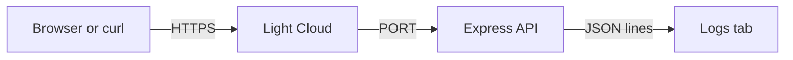

# tutorial-express-api

A small Express 5 API used in the Light Cloud tutorial
[Put a Node.js Express API online](https://blog.light-cloud.com/tutorials/deploy-an-express-api).

It shows the three things every Node.js API needs in production:

- it listens on the port given in `PORT`;
- it reads its settings from environment variables (`GREETING`);
- it writes one JSON log line per request, with a `severity` field.



## Run it

```sh
npm install
npm start
curl http://localhost:8080/hello/Ada
```

| Route | Response |
|---|---|
| `GET /` | greeting and Node.js version |
| `GET /hello/:name` | personal greeting |
| `GET /health` | `{"status":"ok"}` |
